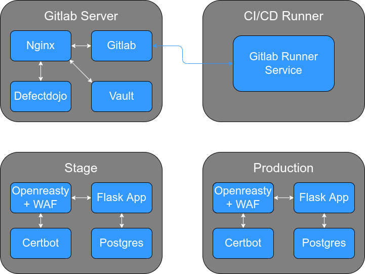

# Соревнование DevSecOps 2023 в МИИГАиК

Для понимания, что написано дальше следует прочитать файл [DevSecOps_2023_Задание.pdf](./DevSecOps_2023_tasks.pdf)

## Инфраструктура компании DORA FOND

### Все репозитории

<details><summary>Подробнее</summary>

[flask_app](https://github.com/TheMaxMur/devsecops23-miigaik-flask_app) -- наше приложение

[iac](https://github.com/TheMaxMur/devsecops23-miigaik-iac) -- наше описание инфраструктуры приложения

[boys_leak_repo](https://github.com/TheMaxMur/devsecops-23-miigaik-boys_leak_repo) -- слитый репозиторий команды Boys

</details>

### Инициализация

<details><summary>Подробнее</summary>

Инфраструктура компании DORA FOND состоит из 4 серверов. Для их создания в облаке Timeweb Cloud использовалась утилита Terraform, которая автоматически создала все 4 сервера, и добавила ssh ключи администраторов для доступа к ним. В папке **terraform** в файле **main.tf** есть более подробное описание.

Чтобы запустить исполнение Terraform манифеста нужно ввести всего одну команду (её исполнение занимает около 20 секунд, создание серверов около минуты):

```bash
$ terraform apply
```

Технические хар-ки серверов:

<details><summary><b>Gitlab</b></summary>

|cpu|ram|disk|
|:---|:---|:---|
|4 cores|6 Gb|50 Gb|

</details>

<details><summary><b>Gitlab runner</b></summary>

|cpu|ram|disk|
|:---|:---|:---|
|2 cores|4 Gb|30 Gb|

</details>

<details><summary><b>Stage</b></summary>

|cpu|ram|disk|
|:---|:---|:---|
|2 cores|4 Gb|30 Gb|

</details>

<details><summary><b>Production</b></summary>

|cpu|ram|disk|
|:---|:---|:---|
|2 cores|4 Gb|30 Gb|

</details>

</br>

Ниже схематично изображена инфраструктура:



</br>

Далее, была проведена первичная настройка, и установка дополнительного ПО с помощью **Ansible**.

Был описан Playbook, и подготовлены конфигурационные файлы для установки и настройки ПО, а именно:

1. Установка **Docker** и **Docker Compose** на всех серверах;
2. **Создание** новых **пользователей** на всех серверах;
3. **Добавление ssh ключей** для новых пользователей;
4. **Копирование файлов gitlab** для его разворачивания на сервере одноименном сервере;
5. **Копирование гит репозитория** defectdojo для его разворачивания на сервере Gitlab;
6. **Копирование файлов HashiCorp Vault** для его разорачивания на сервере Gitlab;
7. **Копирование файлов Nginx** для его разворачивания на сервере Gitlab;
8. **Копирование файлов dockerhub mirror** для его разворачивания на сервере Gitlab;
9. **Получение ssl сертификатов** с помощью Let's Encrypt Certbot;
10. Разворачивание **Nginx**;
11. Разворачивание **GitLab**;
12. Разворачивание **DefectDojo**;
13. Разворачивание **HashiCorp Vault**;
14. Разворачивание **DockerHub proxy mirror**;
15. Скачивание и установка пакета **gitlab-runner** на одноименном сервере;
16. Создание файла **daemon.json** из шаблона, для скачивания докер образов из зеркала DockerHub на сервере Gitlab Runner;
17. **Конфигурирование ssh** на всех серверах.

Исполнение данного плейбука занимает около **16 минут**, после чего инфраструктура будет готова к работе.

Чтобы запустить плейбук, нужно заполнить файл **inventory_init.ini**, а так же добавить доменные A записи к соответствующим серверам, после чего исполнить команду:

```bash
$ ansible-playbook -i inventory/inventory_init.ini configure_servers.yaml
```

После его исполнения следует проверить подключения к серверам с помощью следующей команды (перед её выполнение следует заполнить файл **inventory.ini**, *по аналогии с inventory_init.ini*):

```bash
$ ansible all -i inventory/inventory.ini -m ping -v 
```

Если все сервера ответили, то инфраструктура готова, и можно приступать к выстраиванию процессов **DevSecOps**.


</details>

### Инфраструктура приложения как код (IAC)

<details><summary>Подробнее</summary>

Для автоматической доставки приложения на сервера было подготовлено:
1. Репозиторий с исходным кодом приложения (**flask_app**);
2. Репозиторий IAC, с описанием инфраструктуры приложения как кода, а так же Ansible Roles, по её разворачиванию (**iac**);
3. В каждом из этих этих репозиториев был настроен процесс CI/CD, с помощью которого автоматически:
    1. Проводится сканирование исходного кода на уязвимости, и загрузка результатов сканирования в DefectDojo;
    2. Сборка docker образа приложения;
    3. Сканирование докер образа на уязвимости, и загрузка результатом сканирования в DefectDojo;
    4. Тестирование работоспобности приложения;
    5. Деплой приложения на один из контуров (если изменения были в ветке develop, то на Stage, если в мастер, то на Production)


На схеме ниже можно более наглядно увидеть данный процесс:


Теперь более подробно про содержание репозиториев iac и flask_app, начнем с последнего:

В репозитори **flask_app** содержится:
1. **Исходный код** приложения;
2. **Dockerfile** с инструкциями по сборке докер образа из исходного кода;
3. Файл **.gitlab-ci.yml**, в котором описан процесс CI/CD.


В репозитории **iac** содержится следующее:
1. Файл **docker-compose.yaml**, с описанием архитектуры приложения;
2. **Dockerfile**, в котором описаны инструкции по сборке openreasty;
3. Ansible Role **deploy_project** -- роль, в которой описано, как правильно развернуть новую версию приложения на соответстувющем контуре;
4. **Шаблоны конфигурационных файлов** Openreasty, и **шаблон скрипта**, для получения ssl сертификатов Let's Encrypt
5. Файл **.gitlab-ci.yml**, в котором описан процесс CI/CD.

Давайте более подробно про Ansible Role **deploy_project**:
1. Она копирует файлы docker-compose.yaml и создает файл из шаблона init-letsencrypt.sh;
2. Получает Vault token из параметров role_id и secret_id;
3. Делает запрос в Vault по токену, и получает секреты для базы данных postgresql;
4. Пуллит новые докер образы из частного docker registry, и создает новые контейнеры на их основе.


Переменные для этой роли задаются в папке inventory, и далее в соответствующей контуру папке [stage|prod]. В ней будет файл inventory, и папка group_vars, в файле описаны хосты, с которыми надо взаимодейстовать, а в папке содержаться yaml файлы, в которых заданы переменные.

</details>
